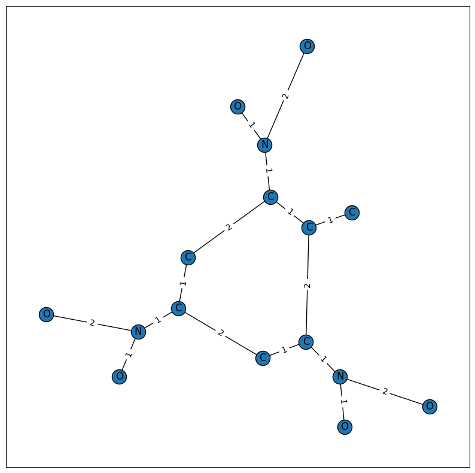

# SSS: Simple Substructure Search

**S**imple **S**ubstructure **S**earch is a Python module, capable of processing input `.sdf` files, creating graphical representations of a molecule, and searching for substructures within a given molecule. This module was developed as part of the final project for CHEM 274A - Programming Languages for Molecular Sciences: Python and C++.

    

<i>Graphical representation of TNT</i>

Instructions

1. Download the `SSS` directory.

2. Inside the terminal, run `make environment` to build the environment contianig all necessary packages and libraries.

3. Import the `Molecule` class from `molecule.py` to begin utilizing the package.

Repository contents

- `/SSS/` - main directory containing package source code, sample Jupyter notebook, and etc.
    - `/sdf/` - sample `.sdf` files used in the sample Jupyter notebook
    - `environment.yaml` - file containing the necessary packages for building the environment
    - `Makefile` - contains commands for building the environment and running test cases
    - `mol_search.ipynb` - sample Jupyter notebook demonstrating the capabilities of the SSS module
    - `molecule.py` - source code for the Molecule class and substructure searching functions
    - `provided.py` - source code for the `parse_sdf()` function used to process `.sdf` files
    - `test_mol.py` - source code for test cases of the module

Class functionalities

- `class Molecule` - proprietary class of the module, takes in a `.sdf` filepath as an input, parses its contents via the `parse_sdf()` function, and constructs a NetworkX graph based on the molecule's elements (nodes) and bond order (edges).
- `draw_graph()` - constructs a visual representation of the NetworkX molecule graph via matplotlib. Nodes are labeled by chemical symbols and edges are labeled by bond order (1:single, 2:double, 3:triple). The visuals use the Kamada-Kawai layout for better visualization of larger, more detailed molecules. This function is called by the `_ipython_display_()` in order to show graph visualization everytime a Molecule object ran as the last part of a code block in a Jupyter notebook.
- `_get_fingerprint()` - returns a 1024-bit molecular fingerprint based on all bond paths up to a length of 7. Each bond path is obtained by iterating through each element and returning all simple paths with a cutoff of 7 via `nx.all_simple_paths()`. Each bond path is then converted to their SMILES equivalent by converting the returned dictionaries to a strings. Each SMILES path is then hashed and used to set two random indices in a 1024-element array of zeroes to one, indicating the presences of a substructure.
- `fingerprint` - property of a Molecule object that calls `_get_fingerprint()` and is able to be used in downstream applications
- `__eq__` - equivalence operator basing equivalence on two Molecule's fingerprints
- `check_substructure_sdf(Molecule)` - first substructure search method that takes another Molecule object, created from a `.sdf` file. The substructure is checked for by subtracting the substructure's fingerprint from the proprietary Molecule's. If any of the positions in the fingerprint are negative, then the substructure is not present. Else, the resulting fingerprint only has elements of either 0 or 1, meaning that the substructure is present.
- `check_substructure_sdf(str)` - second substructure search method that takes a string containing a SMILES specification of a molecule. The substructure is checked for by subtracting the substructure's fingerprint from the proprietary Molecule's. If any of the positions in the fingerprint are negative, then the substructure is not present. Else, the resulting fingerprint only has elements of either 0 or 1, meaning that the substructure is present.

Makefile

- `environment` - builds the environment with all required packages/libraries for the molecule class
- `test` - runs pytest test cases located in `test_mol.py`

Reflection

To begin implementing a molecule class, capable of substructure searching, it was necessary to learn what a molecular fingerprint is and what it entails. Essentially, a molecular fingerprint is a vector of bits that represents the functional groups present and/or absent in a certain molecule. While seemingly abstract and unclear at first, proper planning and trial-and-error came into play when being able to properly implement this class and its capabilities.

1. Initialization and drawing  
    One of the first noticeable things about this assignment was that NetworkX was encouraged for the development of a molecule class. Additionally, the `parse_sdf()` function is provided, reminiscent of Problem Set 3. Initially, I had to distinguish the difference between composition and inheritance, prior to considering them in development. *Composition* is "has a" relationship between classes, meaning a molecule class would have a relationship with the `MolGraph` class from Problem Set 3. *Inheritance* is a "is a" relationship between classes, meaning a molecule class would be the child class of the `MolGraph` class. After toying around with initial implementations, I chose to construct the class via composition of NetworkX and utilize the concepts and members the original `MolGraph` class contained. This is because the provided `parse_sdf()` function works a bit differently, requiring a new implementation altogether. The class still takes in a path to a `.sdf` file, parses through that file, and creates a NetworkX graph according to the file's contents. However, edge_labels are added to better visualize the bond order between two atoms, which is necessary for molecular fingerprinting. The `draw_graph()` function is mostly the same as before, but does not include a color map, as the previous color map only included few elements (HCNO). Given that the main role of this class is for substructure searching, I figured it would be sufficient to have the graphical representation of a molecule be more barebones, since we are more interested in the bond paths and bond orders between atoms.

2. Special method: `_ipython_display_`  
    One requirement of this class was to provide a graphical representation of a molecule specifically in IPython/Jupyter Notebooks. In these notebooks, a special method, `_ipython_display_` can be overloaded to print a visual if the last line of a code cell is an object. By calling `draw_graph()` in this method, we are able to see a visual of a molecule more easily in these notebooks, which is helpful in identifying potential functional groups.

3. Molecular fingerprinting  
    The bulk of this assignment was figuring out how to implement the molecular fingerprint of a molecule. This was a new topic for me and you can only take away so much from 2 pages of specifications. Thankfully, pseudocode was provided that helped simplify the implementation of the actual fingerprint, but what about the paths? This was the challenge for me, and I headed into the NetworkX documentation. After searching around, I arrived at the function `all_simple_paths`, which generated all paths in a graph starting at a node and ending at a target node, without repeating nodes and up to a cutoff depth. This was the exact function I needed since it did not repeat nodes and could be customized to end at a certain depth of 6, unlike the implementation in RDKit. Each path was processed to its corresponding SMILES equivalent, which could then be hashed. A fingerprint was interpreted as a NumPy array of 1024 zeroes (compared to RDKit's 2048 bit vector), which has two random positions set to 1 per hashed path. This implementation was a great mental exercise in trial-and-error, debugging, and creativity. The corresponding `fingerprint()` method was decorated with a `property` decorator, allowing it to be accessed as an object member for subsequent methods.

4. Equivalence overloading  
    To access and overload the equivalence operator, the dunder method, `__eq__`, was modified to first check the right hand side for its type via `isinstance`. If the `other` parameter was not a molecule, then a `TypeError` would be raised. The equivalence operator returns whether or not the fingerprints of both molecules are equal to each other, aka if all the positions in the array are the same. This seemed to be the best option for verifying equivalence as it utilized pre-existing code and features rather than comparing contents from `.sdf` files.

5. Substructure searching  
    To check a substructure's presence in a given molecule, I first did the same type-checking procedure done in the `__eq__` method, with a molecule object in the `.sdf` version versus a string in the SMILES version. `check_substructure_sdf` takes in another molecule object and calculates the difference between the two fingerprints. Clever implementation of the fingerprint as a NumPy array allowed for the use of NumPy array operations, such as array subtraction. Given that random positions in the array would be assigned to a value of 1, a matching substructure would return a matching array with all values being greater than or equal to 0, since the substructure fingerprint would only contain 1's in corresponding indices to the original fingerprint. Returning `np.all(match >=0)` verifies whether or not the resulting array has any negative values, meaning a given substructure is not found in a molecule. The same is done in the SMILES version, but the input is given as a SMILES path string, which is then hashed to create a fingerprint. This implementation, while not as tedious as fingerprinting, was another exercise in intuitive and creative thinking.

6. Testing  
    Initial tests and debugging of the source file were done in a developmental Jupyter Notebook, which was very helpful in seeing the outputs of each incremental implementation. Test cases were added to its own source file and run via pytest, which allowed for the parametrization of certain test cases, such as type-checking an instance and verifying whether a molecule has an equivalent or a substructure.

7. Sample Jupyter Notebook  
    The sample Jupyter Notebook, `mol_search.ipynb`, demonstrates the capabilities of the class and its substructure searching methods, using `.sdf` files. I figured this implementation would be overall more intuitive compared to command line searching, since a substructure screen in the command line would only be compatible with string inputs via `sys.argv` or `sys.argparse`. By implementing both methods for use in a Jupyter Notebook, a molecule can first be visualized properly via matplotlib and screened for certain functional groups, to ensure robustness of code. Overall, my class design was more tailored towards use in interactive notebooks since the Problem Set 3's class was very similar in concept. However, another approach could have been more command line based and oriented, in order to more quickly search for substructures.

Overall, the development of this class was much more challenging conceptually compared to the matrix class in C++, but more intellectually rewarding. It was another great exercise in class design, particularly in making decisions that ultimately the class's use (notebooks vs. command line). While composition was used in this project, inheritance could have been certainly viable from Problem Set 3's class. Python still ends up being my preferred language for programming and development, but both parts of this final project have given me a greater sense of appreciation and understanding for both languages, which will no doubt be carried onwards in future classes.

Future improvements

- Implement constructor that takes in atoms and bonds via SMILES instead of only `.sdf` files.
- Implement CPK coloring in graph.
- Implement a command-line interface for substructure searching via SMILES and `argv` or `argparse`.

